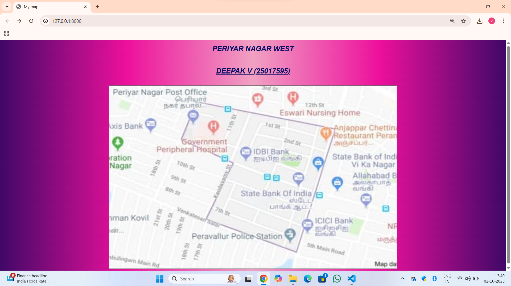
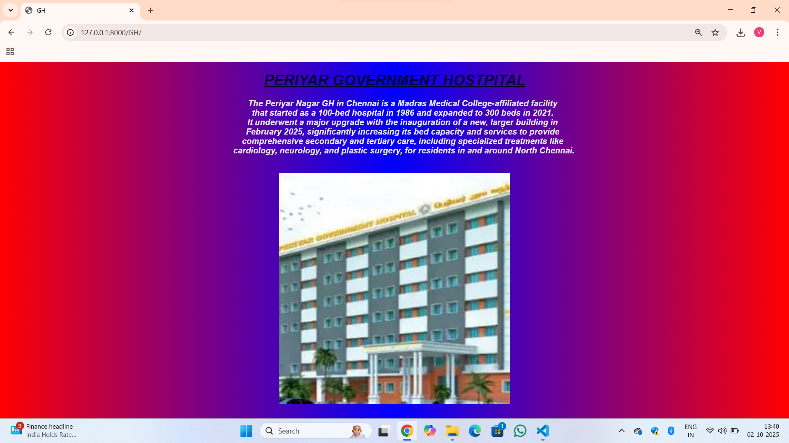
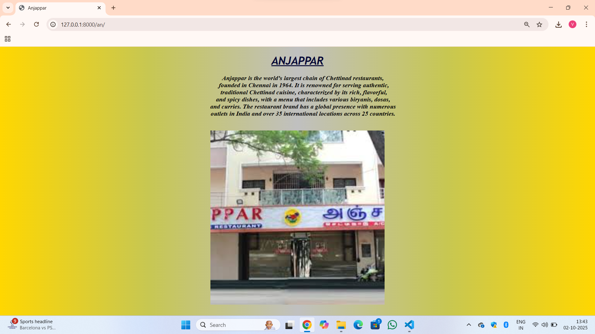

# Ex04 Places Around Me
# Date:02-10-25
# AIM
To develop a website to display details about the places around my house.

# DESIGN STEPS
## STEP 1
Create a Django admin interface.

## STEP 2
Download your city map from Google.

## STEP 3
Using <map> tag name the map.

## STEP 4
Create clickable regions in the image using <area> tag.

## STEP 5
Write HTML programs for all the regions identified.

## STEP 6
Execute the programs and publish them.

# CODE
```
map.html:

<!DOCTYPE html>
<html lang="en">
<head>
    <meta charset="UTF-8">
    <meta name="viewport" content="width=device-width, initial-scale=1.0">
    <title>My map</title>
    <style>
        h1,h2{
            text-align: center;
            font-style: italic;
            color: rgba(8, 13, 101, 1);
            font-size: xx-large;
            font-weight: bolder;
            font-family: Arial, Helvetica, sans-serif;
            text-transform: uppercase;
        }
        body{
            background-image: linear-gradient(90deg,rgb(64, 8, 103),rgb(237, 16, 156),rgb(241, 161, 195),rgb(237, 16, 156),rgb(64, 8, 103));
        }
    </style>
</head>
<body>
    <h1><u>Periyar Nagar West</u></h><br><br>
    <h2><u>Deepak V (25017595)</u></h2><br>
    <center>
        
        <map name="#DeepakMap">
            <area shape="poly" coords="500,180,490,190,470,175" href="" title="GH">
            <area shape="poly" coords="400,150,350,140,370,125" href="" title="Post Office">
            <area shape="poly" coords="800,625,900,650,793,678" href="" title="Police Station">
            <area shape="poly" coords="620,310,630,181,590,290" href="" title="IDBI Bank">
            <area shape="poly" coords="997,213,998,191,952,231" href="" title="Anjappar"> 
        </map>
    </center>
</body>
</html>

GH.html:

<!DOCTYPE html>
<html lang="en">
<head>
    <meta charset="UTF-8">
    <meta name="viewport" content="width=device-width, initial-scale=1.0">
    <title>GH</title>
    <style>
        h1{
             text-align: center;
            font-style: italic;
            color: rgb(5, 7, 52);
            font-size: xx-large;
            font-weight: bolder;
            font-family: Arial, Helvetica, sans-serif;
            text-transform: uppercase;
        }
        body{
            background-image: linear-gradient(90deg,red,blue,red);
        }
        pre{
            font-style: italic;
            color: rgb(230, 231, 241);
            font-size: large;
            font-weight: bold;
            font-family: Arial, Helvetica, sans-serif;
        }
        </style>
    
</head>
<body>
    <h1><u>Periyar Government Hostpital</u></h1>
    <pre align="center">
        The Periyar Nagar GH in Chennai is a Madras Medical College-affiliated facility 
        that started as a 100-bed hospital in 1986 and expanded to 300 beds in 2021. 
        It underwent a major upgrade with the inauguration of a new, larger building in 
        February 2025, significantly increasing its bed capacity and services to provide 
        comprehensive secondary and tertiary care, including specialized treatments like 
        cardiology, neurology, and plastic surgery, for residents in and around North Chennai.
    </pre>
    <center>
        
    </center>    
</body>
</html>

postoffice.html:

<!DOCTYPE html>
<html lang="en">
<head>
    <meta charset="UTF-8">
    <meta name="viewport" content="width=device-width, initial-scale=1.0">
    <title>Post Office</title>
<style>
        h1{
             text-align: center;
            font-style: italic;
            color: rgb(5, 7, 52);
            font-size: xx-large;
            font-weight: bolder;
            font-family: 'Franklin Gothic Medium', 'Arial Narrow', Arial, sans-serif;
            text-transform: uppercase;
        }
        body{
            background-image: linear-gradient(90deg,rgb(15, 239, 15),cyan,rgb(15, 239, 15));
        }
        pre{
            font-style: italic;
            color: black;
            font-size: large;
            font-weight: bold;
            font-family: Cambria, Cochin, Georgia, Times, 'Times New Roman', serif;
        }
    </style>
</head>
<body>
    <h1><u>Post Office</u></h1>
    <pre align="center">
        The Periyar Nagar Post Office is located at No. 33, Balasubramanian Street,
        Jawahar Nagar, Chennai - 600082, and serves the residents of the northern 
        Chennai area. It provides standard postal services, small savings schemes, 
        insurance coverage, and is set to become a Post Office Passport Seva Kendra 
        (POPSK) to offer passport services. The office has a wheelchair-accessible 
        entrance and parking.
    </pre>
<center>
    
</center>
</body>
</html>

station.html:

<!DOCTYPE html>
<html lang="en">
<head>
    <meta charset="UTF-8">
    <meta name="viewport" content="width=device-width, initial-scale=1.0">
    <title>Police Station</title>
<style>
        h1{
             text-align: center;
            font-style: italic;
            color: rgb(5, 7, 52);
            font-size: xx-large;
            font-weight: bolder;
            font-family: 'Times New Roman', Times, serif;
            text-transform: uppercase;
        }
        body{
            background-image: linear-gradient(90deg,red,orange,yellow,orange,red);
        }
        pre{
            font-style: italic;
            color: black;
            font-size: large;
            font-weight: bold;
            font-family: Cambria, Cochin, Georgia, Times, 'Times New Roman', serif;
        }
    </style>    
</head>
<body>
    <h1><u>peravallur police station</u></h1>
    <pre align="center">
        The Peravallur Police Station is a new facility in Jawahar Nagar, Chennai, 
        serving the Peravallur residential area. It is located at the junction of
        Venkatesan Salai and Siva Elango Salai. The building is well-planned with 
        adequate space, a rainwater harvesting system, and good lighting, though 
        residents have previously expressed concern about seized vehicles being 
        dumped on a nearby open space. The station is known to respond to community 
        issues and emergencies. A 2019 report noted that officers at the station 
        provided temporary shelter and assistance to several elderly homeless people
        who had been abandoned by their families.
    </pre>
<center>
    
</center>
</body>
</html>

bank.html:

<!DOCTYPE html>
<html lang="en">
<head>
    <meta charset="UTF-8">
    <meta name="viewport" content="width=device-width, initial-scale=1.0">
    <title>IDBI Bank</title>
<style>
        h1{
             text-align: center;
            font-style: italic;
            color: rgb(5, 7, 52);
            font-size: xx-large;
            font-weight: bolder;
            font-family: Verdana, Geneva, Tahoma, sans-serif;
            text-transform: uppercase;
        }
        body{
            background-image: linear-gradient(90deg,orange,yellow,lightyellow,yellow,orange);
        }
        pre{
            font-style: italic;
            color: black;
            font-size: large;
            font-weight: bold;
            font-family: Arial, Helvetica, sans-serif;
        }
    </style> 
</head>
<body>
    <h1><u>IDBI Bank</u></h1>
    <pre align="center">
        IDBI Bank, or Industrial Development Bank of India, was established 
        in 1964 as a subsidiary of the Reserve Bank of India (RBI). Its headquarters
        are in Mumbai. The bank's objective was to provide financial and credit 
        facilities for the development of Indian industry. It transitioned from 
        a Development Financial Institution (DFI) to a full-fledged commercial bank 
        in October 2004.
    </pre>
<center>
    
</center>
</body>
</html>

Anjappar.html:

<!DOCTYPE html>
<html lang="en">
<head>
    <meta charset="UTF-8">
    <meta name="viewport" content="width=device-width, initial-scale=1.0">
    <title>Anjappar</title>
<style>
        h1{
             text-align: center;
            font-style: italic;
            color: rgb(5, 7, 52);
            font-size: xx-large;
            font-weight: bolder;
            font-family: 'Trebuchet MS', 'Lucida Sans Unicode', 'Lucida Grande', 'Lucida Sans', Arial, sans-serif;
            text-transform: uppercase;
        }
        body{
            background-image: linear-gradient(90deg,gold,rgb(199, 199, 82),silver,rgb(199, 199, 82),gold);
        }
        pre{
            font-style: italic;
            color: black;
            font-size: large;
            font-weight: bold;
            font-family: 'Times New Roman', Times, serif;
        }
    </style>
</head>
<body>
    <h1><u>Anjappar</u></h1>
    <pre align='center'>
        Anjappar is the world's largest chain of Chettinad restaurants, 
        founded in Chennai in 1964. It is renowned for serving authentic,
        traditional Chettinad cuisine, characterized by its rich, flavorful,
        and spicy dishes, with a menu that includes various biryanis, dosas, 
        and curries. The restaurant brand has a global presence with numerous 
        outlets in India and over 35 international locations across 25 countries. 
    </pre> 
<center>
    
</center>
</body>
</html>
```
# OUTPUT







# RESULT
The program for implementing image maps using HTML is executed successfully.
